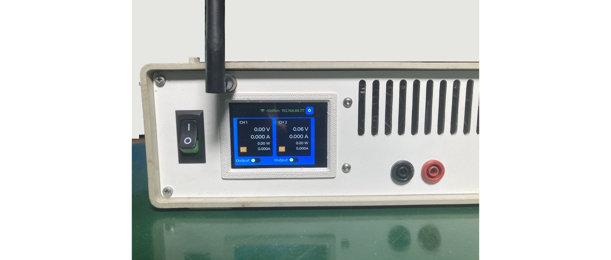
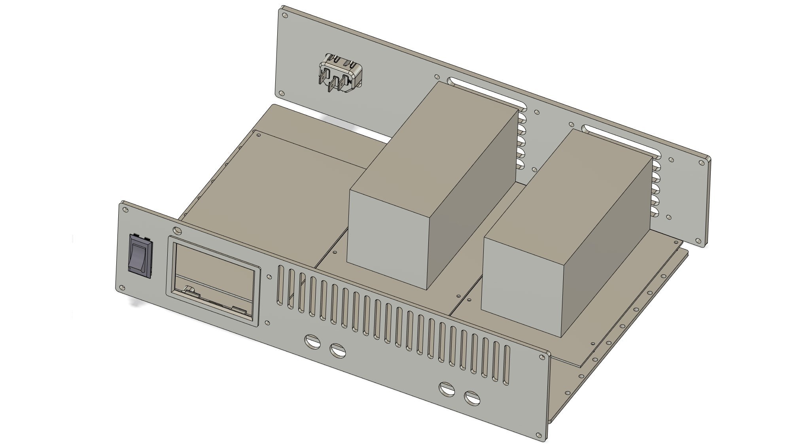
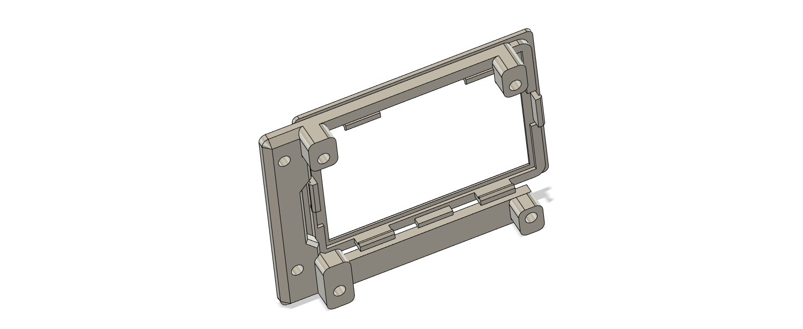
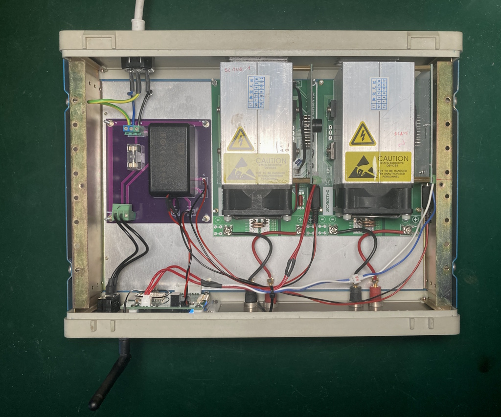
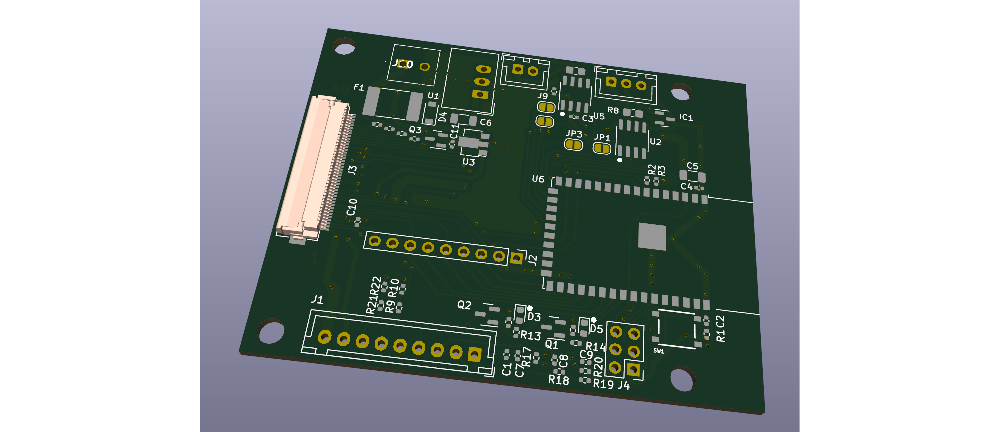
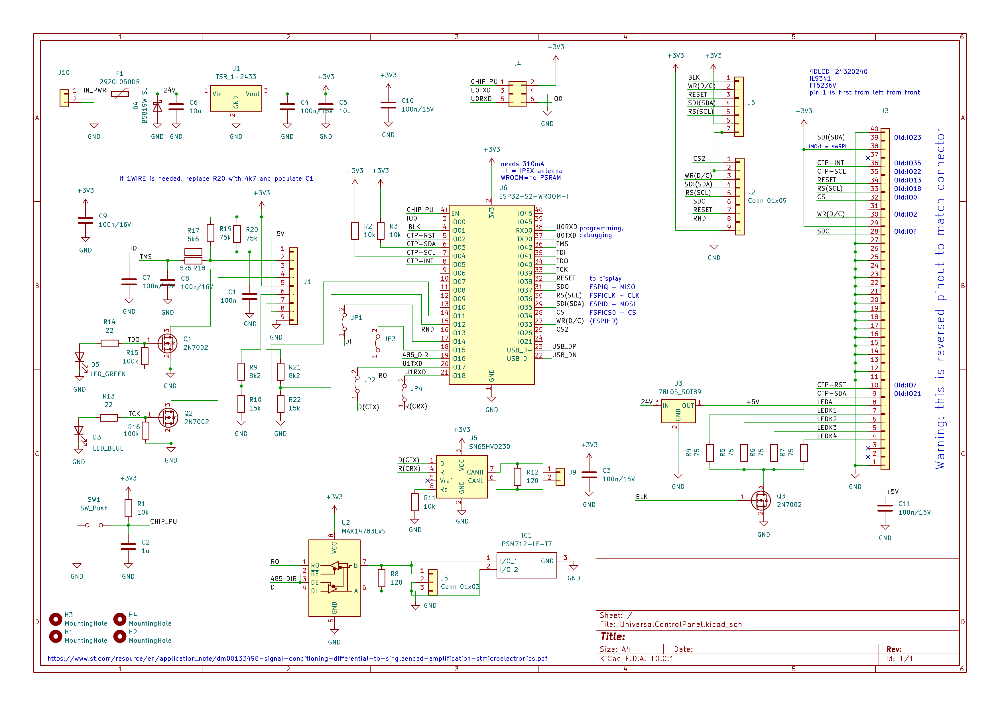

# Overview

A while ago I noticed the availability of the cheap RS485 controllable DC load modules on Taobao. I had an appropriate instrument case available and had occasional need of DC load for testing batteries. Packaging the modules in a small case with a nice user interface seemed like a good project to learn more about developing with ESP32 while being small enough to be finished.

Other than learning objectives and experimental verification of feasibility of touchscreen-only instrument interface, the list of requirements as they evolved during development is:

- 2 channels DC electronic load: 200V, 10A
- 4 modes (CC, CV, CR, CP) + battery discharge mode
- interface:
  - 2.4" SPI display with capacitive touch
  - telnet SCPI interface (port 5025)
  - REST SCPI interface (port 80)
  - responsive web interface (with sockets)
- rudimentary charting
- Over the air (OTA) updates with CI/CD (continuous integration/continuous deployment)
- reasonable level of test coverage
- UDP logging for debugging
- rough adherence to CE standards (e.g. mains isolation, fusing, earthing, etc.)



Considering the availability and cost of real laboratory DC loads, the project is "Completely pointless" from economic perspective.

Project went through the following phases:

- initial research of the protocol (the documentation was in Chinese) with proof-of-concept python script to control the modules
- design of the main ESP32S3 controller board (in KiCad; designed for JLCPCB assembly)
- mechanical design & machining of the front and back panels (in Fusion360)
- development of first version of the firmware (on Arduino platform using ESP32 built-in FreeRTOS)
- design of power supply PCB
- development of second version of the firmware (switched to native ESP-IDF platform)

As of writing of this report, the project is finished.

# Hardware

## Mechanical design

Mechanical design is not the primary focus of this report, however, here are some details for the interested reader. The blank instrument was acquired in Horjul a long time ago. The layout was designed in Fusion360 and front and back plate were machined on a CNC mill. The layout followed the standard instrument design. There was no thermal planning or modelling, I used heuristic approach of "make the holes as big as possible". All the heavy elements are mounted on a subplate that allows mechanical rigidity and no protruding holes at the bottom of the instrument case.



Extra care was made to create a design that allows for easy assembly and mounting of the display unit. Long lines for 40Mhz SPI signals (common source of signal integrity and EMI issues) are avoided by placing the display controller board right behind the display. A special two-sided bracket was designed for snap-fit into aluminium front plate, preventing the board touching the (grounded) aluminium and allowing for relatively good touch interface experience (final evaluation revealed that edges still don’t register well, but they are good enough).



Initial prototype had a 100x160mm universal board to house the off-the-shelf switching power supply and connector for distribution of the power to the modules. But at current PCB prices I decided to make a dedicated PCB. It didn't turn out great, but better than the universal board.



## Electronics

The main controller board was designed in KiCad specifically using the parts catalogue from JLCPCBA to allow for delivery of assembled board. Through hole components and display were ordered from Digikey and hand soldered. It features a now almost obsolete ESP32S2 microcontroller, RS485 and CAN transceivers as well as 24V to 3.3V isolated DC-DC converter. The latter one also features input reverse polarity protection - a good practice if you know who'll be assembling the board.

The main controller board was envisioned to be a general purpose controller for various instruments - that's how the extra CAN controller and open collector FETs found their way on the board. Extra breakout pins and PCB jumpers to cut connections to some peripherals were added for the same reason.

LCD is powered by linear regulator, directly from the 24V supply. This was a kind of balancing decision: ESP32S2 needs a lot of power headroom (for wireless negotiation) so the first choice was to have one DC-DC to step down to 5V (and power both). But that would require a one step larger input DC-DC (2W) and another either linear or switching regulator to step down to 3.3V for the ESP32S2. I landed on current configuration without much more analysis.



Reducing the number of actually unneeded features would allow me to design the board with a little less cheesy ground plane.

After a mixed experience with initializing and usage different Aliexpres displays, I decided to use 4LCD display available from Digikey (PN: 4DLCD-24320240 with IL9341 controller and
FT6236V touch). It's a bit on the small side, but capacitive touch is a significant improvement over resistive touch - and was a major factor in the decision to use this display.



# Software

## Sousim interface protocol

The DC load modules (SOUSIM) use Modbus RTU protocol over RS485. This is an old, slow industrial protocol, but it is simple and well supported. It's a packet-based protocol: you send a command to one of the slave devices (address) and the slave responds with the requested data.

The data is organized in registers, which are 16-bit values. The registers can be read or written to, depending on the command. The most common ones are reading and writing holding registers and while technically you can request access to multiple registers at once, usually you just read or write one register at a time.

### Example RTU request

The interaction with registers is abstracted away with the library in ESP-IDF. However, when nothing comes back from the library and you bring out the oscilloscope, it's helpful to know what the actual bytes on the wire look like. The following is an example of a request to read 13 registers starting from 0x0000 (Modbus address 40001) from slave device with address 1:

```
01 03 00 00 00 0D 84 0F
```

- 01 - slave address
- 03 - read holding registers (to write a single hold register, use 0x06)
- 00 00 - The address of the first register (40108-40108 = 0x0000 )
- 00 0D - number of required registers (13)
- 84 0F - CRC checksum

### Holding registers

"holding registers" is Modbus terminology for registers that can be read and written to. The SOUSIM modules have the following holding registers:

| Actual bytes | Modbus address | Function                                                        |
| ------------ | -------------- | --------------------------------------------------------------- |
| 0x0000       | 40001          | Set slave address (1-255)                                       |
| 0x0001       | 40002          | Mode setting (see below)                                        |
| 0x0002       | 40003          | Enable (0: off, 1: on)                                          |
| 0x0003       | 40004          | Set voltage [10mV] (20000 default =200.00V)                     |
| 0x0004       | 40005          | Set current [mA]                                                |
| 0x0005       | 40006          | Set CP power [100mW] ? ? HR9 Over current setting (5500= 55A) ? |
| 0x0006       | 40007          | Set CR resistance [100mOhm]                                     |
| 0x0007       | 40008          | Functions (see below)                                           |
| 0x0008       | 40009          | Calibration: voltage offset? (def: 4)                           |
| 0x0009       | 40010          | Calibration: voltage scale? (def: 10100)                        |
| 0x000A       | 40011          | Calibration: current offset? (def: 14750)                       |
| 0x000B       | 40012          | Calibration: current scale? (def: 13674)                        |

Modes (modbus 40002):

- 0: voltage
- 1: current
- 2: power
- 3: resistance
- 4: voltage and current

Functions detail description (modbus 40008):

- 1 fan low
- 2 fan mid
- 3 fan high
- 4 buzzer on
- 5 mAh reset
- 6 Wh reset
- 10 voltage tracking off
- 11 voltage tracking on
- 12 current tracking off
- 13 current tracking on
- can modify other standard baud rate: 4800,9600,14400,19200,38400,56000,57600 (default is 9600)

### Input registers

"input registers" is Modbus terminology for registers that can only be read. The SOUSIM modules have the following input registers:

| Actual bytes | Modbus address | Function                         |
| ------------ | -------------- | -------------------------------- |
| 0x0000       | 30001          | slave address                    |
| 0x0001       | 30002          | current mode (0..4)              |
| 0x0002       | 30003          | enabled (0..1)                   |
| 0x0003       | 30004          | temperature 1 (0..100C)          |
| 0x0004       | 30005          | EXT temperature 2 (N/C)          |
| 0x0005       | 30006          | EXT DVM measurement voltage [mV] |
| 0x0006       | 30007          | voltage [10mV]                   |
| 0x0007       | 30008          | current [mA]                     |
| 0x0008       | 30009          | power [mW]                       |
| 0x0009       | 30010          | current resistance ?             |
| 0x000A       | 30011          | current capacity [mAh] ?         |
| 0x000B       | 30012          | current capacity [WAh] ?         |
| 0x000C       | 30013          | running time [s] ?               |

## Instrument SCPI command set

The instrument implements a subset of the [SCPI](https://en.wikipedia.org/wiki/Standard_Commands_for_Programmable_Instruments) (Standard Commands for Programmable Instruments) protocol over two transport options — telnet (TCP port 5025) and REST (HTTP `POST /api/scpi`). The telnet interface supports both queries and continuous measurement streaming, while the HTTP interface is write-only (fire-and-forget commands). Real-time measurement data is also available via WebSocket (`/ws`) on port 80.

### Common commands

| Command     | Description                 | Response                                         |
| ----------- | --------------------------- | ------------------------------------------------ |
| `*IDN?`     | Instrument identification   | `samo4,CPDEL,<version>/<slot>/<state>`           |
| `SYST:ERR?` | Query and clear error queue | `0,"No error"` or `-300,"Device-specific error"` |

### Output control

| Command             | Description                            |
| ------------------- | -------------------------------------- |
| `OUTP<ch>:STAT ON`  | Enable output on channel <ch> (1 or 2) |
| `OUTP<ch>:STAT OFF` | Disable output on channel <ch>         |

### Source configuration

| Command                 | Description                          |
| ----------------------- | ------------------------------------ |
| `SOUR<ch>:FUNC VOLT`    | Set mode to constant voltage (CV)    |
| `SOUR<ch>:FUNC CURR`    | Set mode to constant current (CC)    |
| `SOUR<ch>:FUNC POW`     | Set mode to constant power (CP)      |
| `SOUR<ch>:FUNC RES`     | Set mode to constant resistance (CR) |
| `SOUR<ch>:FUNC?`        | Query current mode (returns 0-3)     |
| `SOUR<ch>:VOLT <value>` | Set voltage setpoint in volts        |
| `SOUR<ch>:VOLT?`        | Query voltage setpoint               |
| `SOUR<ch>:CURR <value>` | Set current setpoint in amperes      |
| `SOUR<ch>:CURR?`        | Query current setpoint               |
| `SOUR<ch>:POW <value>`  | Set power setpoint in watts          |
| `SOUR<ch>:POW?`         | Query power setpoint                 |
| `SOUR<ch>:RES <value>`  | Set resistance setpoint in ohms      |
| `SOUR<ch>:RES?`         | Query resistance setpoint            |

### Measurement queries

| Command              | Description                | Response                 |
| -------------------- | -------------------------- | ------------------------ |
| `MEAS:VOLT? (@<ch>)` | Single voltage measurement | Numeric value in volts   |
| `MEAS:CURR? (@<ch>)` | Single current measurement | Numeric value in amperes |

### Continuous measurement streaming (telnet only)

The telnet interface supports subscribing to a stream of measurements. Once subscribed, the server pushes readings as they arrive from the modules:

| Command                      | Description                                  |
| ---------------------------- | -------------------------------------------- |
| `MEAS:VOLT:CONT ON (@<ch>)`  | Subscribe to continuous voltage readings     |
| `MEAS:VOLT:CONT OFF (@<ch>)` | Unsubscribe from continuous voltage readings |
| `MEAS:CURR:CONT ON (@<ch>)`  | Subscribe to continuous current readings     |
| `MEAS:CURR:CONT OFF (@<ch>)` | Unsubscribe from continuous current readings |

### Battery discharge mode

| Command                | Description                                                                             |
| ---------------------- | --------------------------------------------------------------------------------------- |
| `BATT<ch>:LVP <value>` | Set low voltage protection threshold in volts (output auto-disables below this voltage) |

### WebSocket real-time feed

When connected via the web interface, the server pushes JSON measurement frames to all WebSocket clients at `/ws`:

```json
{
  "type": "msmt",
  "cmd": "SCPI_MEASUREMENTS",
  "channel": 0,
  "voltage": 12.3456,
  "current": 0.5,
  "mode": 1,
  "outputEnabled": 1,
  "error": 0
}
```

### Error responses

| Error code | Message                   | Condition         |
| ---------- | ------------------------- | ----------------- |
| `-113`     | `"Undefined header"`      | Unknown command   |
| `-102`     | `"Syntax error"`          | Malformed command |
| `-300`     | `"Device-specific error"` | (Not implemented) |

### Usage examples

```scpi
*IDN?
samo4,CPDEL,1.2.3/ota_0/confirmed

OUTP1:STAT ON
SOUR1:FUNC CURR
SOUR1:CURR 0.5
MEAS:VOLT? (@1)
12.3456
MEAS:CURR? (@1)
0.4987

BATT1:LVP 3.0
```

The same commands can be sent via HTTP:

```bash
curl -X POST http://192.168.88.117/api/scpi -d "SOUR1:CURR 0.5"
```

## Software architecture

There were a few core architectural decisions made during the development of the firmware:

The first one was to switch from Arduino platform to **native ESP-IDF**. Compared to Arduino and its inconsistent mix of C and C++, poor control over build process, error-prone tooling and strange FreeRTOS integration, the ESP-IDF is a much more powerful tool, allowing full control, consistent naming practices and enjoyable development.

The second was to absolutely require the possibility to simulate the user interface in a desktop environment - no matter which library you use for graphical user interface, without **GUI simulator**, the turnaround for each little change to the position of a button is way too long. Previously I used LVGL library with Edgeline UI editor but combining simulator with LLM generated user interface code is much more efficient in time, flexibility and the quality.

The most important architectural decision was to use **FreeRTOS queues** to communicate between the (many) different parts of the software. Data structures based on SCPI commands and responses are passed between the tasks, which allows for a very clean separation of concerns and makes it easy to add new features without breaking existing ones. It also allows for easy testing, little to no dependencies between modules, very clean and readable code and small context requirements for LLMs.

So here are all the modules:

### Core infrastructure

- `src/app_bus.h` Defines a 24-byte message struct (`bus_msg_t`) carrying a command type (`bus_cmd_t`), source identifier (`bus_source_t`), channel, flags, and a 16-byte payload union. Modules subscribe their FreeRTOS queue handle via `app_bus_subscribe()` and the bus broadcasts every published message to all subscribers. There is no direct function calls between modules - everything goes through the bus. This makes the system extremely decoupled: adding a new feature means creating a new task, subscribing its queue, and publishing/receiving the relevant messages.

- `src/scpi.h` A hand-written SCPI command decoder that parses plain-text strings like `"SOUR1:VOLT 2.2"` or `"MEAS:VOLT? (@1)"` into `bus_msg_t` structs. It handles all the standard SCPI commands for the instrument: output state, mode selection (VOLT/CURR/POW/RES), setpoints, measurements queries, continuous measurement subscriptions, and identification. Non-SCPI extensions like `BATT1:LVP` add battery discharge mode support.

- `src/freertos_includes.h` — A thin abstraction layer that unifies FreeRTOS includes between ESP-IDF and the SDL port, enabling the same source files to compile for both targets.

### Hardware controller

- `esp/main/dc_load_controller.c` — The Modbus RTU master that communicates with the physical SOUSIM DC load modules over RS485. Runs as a FreeRTOS task that periodically polls all input registers (voltage, current, temperature, capacity) from both load channels, and writes setpoint changes (mode, enable, voltage, current, power, resistance) back. It subscribes to the app_bus and responds to all control commands by writing the appropriate Modbus holding registers. It also implements low-voltage cutoff protection for battery discharge mode (the only feature that's not available on the SOUSIM modules), and marks measurements as "stale" if Modbus communication fails for more than 1 second.

### Communication interfaces

- `esp/main/scpi_server.c` — A TCP server on port 5025 that implements the telnet SCPI interface. Accepts up to 2 concurrent clients, decodes incoming SCPI commands using the shared `scpi_decode()`, and routes them to the app_bus. Supports continuous measurement streaming (`MEAS:VOLT:CONT ON (@1)`), where measurements are pushed to the requesting socket as they arrive from the controller. Handles telnet IAC escaping and proper client disconnect.

- `esp/main/web_server.c` — An HTTP server (port 80) built on ESP-IDF's `esp_http_server`. Serves a responsive web interface from SPIFFS flash storage, provides a WebSocket endpoint (`/ws`) that broadcasts real-time JSON measurement updates to all connected browsers, and exposes a REST SCPI endpoint (`POST /api/scpi`) for controlling the instrument via HTTP.

### Connectivity

- `esp/main/wireless_controller.c` — WiFi station management. Handles connection to the configured access point, stores SSID and password in NVS (non-volatile storage), and supports runtime credential changes with reboot. The UI exposes a keyboard screen for entering WiFi credentials on the device.

- `esp/main/udp_log.h` — A minimal header-only UDP log mirror that redirects ESP-IDF log output to a remote machine via UDP. Useful for debugging when the device is not connected to a serial console. Receivable with `socat -u UDP-RECV:9999 STDOUT`.

### Display

- `esp/main/display.c` — Initializes the 2.4" SPI display with LVGL's display driver interface. Configures the SPI bus, DMA, and backlight control (the latter one was a source of some frustration during development - lots of work went into investigating numbers of other causes, but ultimately in order to see thing on the display, you need to turn on the backlight). The SPI bus sadly works reliably only up to 40MHz, which limits the maximum refresh rate of the display and makes full-screen animations choppy. I'm using ESP-IDF built-in LCD driver, but I left a big chunk of commented-out code that was used to manually initialize the display during development debugging.
- `esp/main/touch.c` — Initializes the capacitive touch controller and provides adjusted coordinates to LVGL's input device interface. Using ESP-IDF built-in FT6206 driver.

### OTA updates

- `esp/main/ota.c` — Over-the-air firmware update module. Uses dual OTA partitions with rollback support (`ESP_OTA_IMG_PENDING_VERIFY`). Can fetch version info from a remote server, download and apply the new firmware image, and confirm or roll back on next boot.

### User interface (shared between ESP32 and simulator)

- `src/ui/` — The graphical user interface. The UI subscribes to the app_bus to receive live measurement updates and updates the LVGL widgets accordingly. User interactions (button presses, value changes) are published back to the bus as commands. Split into a file for each screen:
  - main screen
  - channel detail screen
  - graph screen
  - settings screen
  - numpad overlay (dynamic: created on demand, destroyed after use)
  - modal keyboard overlay
  - modal dialog overlay
  - OTA update screen (dynamic without bothering to create teardown - meant for single use - after update, the device reboots)
  - WiFi configuration screen (dynamic without teardown)
  - touch input debug screen (optional with `#ifdef` guard)

### Data logging

- `src/rrd.c` — A simple RRDtool-inspired ring-buffer data logger. Maintains two archives per channel: a high-resolution 5-second archive (60 points = 5 minutes of history) and a low-resolution 1-minute archive. Values are averaged within each time slot. Always listens to the app_bus for new data. The graph screen reads from these archives for display. Ran out of memory space for making this a truly usable graph.

### Simulator

- `src/sim_controller.h` — The desktop simulator version of `dc_load_controller`. Instead of talking to real Modbus hardware, it maintains a virtual state machine that tracks setpoints and responds to queries with the commanded values. This allows the full UI to be developed and tested on a PC without any hardware.

- `sim/main.c` — Sets up SDL2 for rendering, FreeRTOS in a background Windows thread, and creates all the simulation tasks (LVGL timer, heartbeat monitor, simulated controller, RRD logger). The LVGL display flush and input read callbacks use SDL instead of real SPI hardware.

### Boot sequence

On the real hardware (`esp/main/main.c`):

1. Initialize NVS (non-volatile storage)
2. Initialize LVGL core
3. Initialize display (SPI, backlight)
4. Initialize touch controller
5. Connect to WiFi (using flash-stored credentials)
6. Start UDP log mirror
7. Start Modbus controller task (polls SOUSIM modules, subscribes to app_bus)
8. Optional: start RRD logging task
9. Initialize UI (creates all LVGL screens, subscribes to app_bus for live data)
10. Start web server (HTTP + WebSocket, subscribes to app_bus)
11. Start SCPI telnet server
12. Create LVGL timer task (calls `lv_timer_handler()` every 5 ms)

All modules communicate exclusively through the **app_bus** — there are no direct inter-module function calls, no shared global state beyond the read-only channel data struct used by the UI, and no mutual dependencies between the controller, UI, web interface, and SCPI server. This architecture proved essential for keeping the project manageable, although the specifics of the implementation changed a few times during development. For example a model where "clients" (UI, web, SCPI) would have to subscribe to the measurements was replaced with a simpler model where the controller publishes all measurements to the bus, and clients simply read the latest values from the bus (whatever is of interest to particular module).

<!-- prettier-ignore-start -->
\begin{figure}[H]
\centering
\begin{tikzpicture}[>=Stealth,
    bus/.style={
        rectangle, draw=blue!60, very thick, fill=blue!6, rounded corners=4pt,
        minimum width=16cm, minimum height=1.6cm, align=center
    },
    mod/.style={
        rectangle, draw=green!50!black!60, thick, fill=green!3, rounded corners=3pt,
        minimum width=2.4cm, minimum height=1.2cm, align=center
    },
    pubarrow/.style={->, thick, blue!50!black},
    subarrow/.style={->, thick, green!60!black},
    qlab/.style={font=\tiny\ttfamily, text=black, fill=white, inner sep=1pt},
    msg/.style={font=\tiny, text=gray!50!black},
]

% app\_bus (top center)
\node[bus] (bus) at (0,0) {
    \textbf{app\_bus} \quad\texttt{s\_subscribers[0..count-1]}\\[2pt]
    \footnotesize\texttt{app\_bus\_publish() $\rightarrow$ \textbf{foreach:} xQueueSend(sub, msg, 0)}
};

% Publisher-only modules (above bus)
\node[mod] (wifi) at (-6.0, 2.6) {Wireless\\Controller};
\draw[pubarrow] (wifi.south) -- (bus.north -| wifi.south)
    node[qlab, fill=white, pos=0.3, right] {Wifi status, RSSI};

% Modules (below bus)
\node[mod] (dc)   at (-6.5, -2.6) {DC Load\\Controller};
\node[mod] (scpi) at (-3.9, -2.6) {SCPI\\Server};
\node[mod] (web)  at (-1.3, -2.6) {Web\\Server};
\node[mod] (gui)  at ( 1.3, -2.6) {GUI\\(LVGL)};
\node[mod] (rrd)  at ( 3.9, -2.6) {RRD\\Logger};
\node[mod, dashed] (sim)  at ( 6.5, -2.6) {Sim\\Controller};

% Subscribe arrows: bus to modules — labelled with what each module actually uses
\draw[subarrow] ([xshift=-1mm]bus.south -| dc.north) -- ([xshift=-1mm]dc.north)
    node[qlab, fill=white, pos=0.3, left] {set, query};
\draw[subarrow] ([xshift=-1mm]bus.south -| scpi.north) -- ([xshift=-1mm]scpi.north)
    node[qlab, fill=white, pos=0.3, left] {meas};
\draw[subarrow] ([xshift=-1mm]bus.south -| web.north) -- ([xshift=-1mm]web.north)
    node[qlab, fill=white, pos=0.3, left] {meas};
\draw[subarrow] ([xshift=-1mm]bus.south -| gui.north) -- ([xshift=-1mm]gui.north)
    node[qlab, fill=white, pos=0.3, left] {meas \& status};
\draw[subarrow] ([xshift=-1mm]bus.south -| rrd.north) -- ([xshift=-1mm]rrd.north)
    node[qlab, fill=white, pos=0.3, left] {meas};
\draw[subarrow] ([xshift=-1mm]bus.south -| sim.north) -- ([xshift=-1mm]sim.north)
    node[qlab, fill=white, pos=0.3, left] {set, query};

% Publish arrows (module to bus) — vertical, offset right to not interfere with subscribe arrows
\draw[pubarrow] ([xshift=1mm]dc.north)  -- ([xshift=1mm]bus.south -| dc.north)
    node[qlab, fill=white, pos=0.3, right] {meas};
\draw[pubarrow] ([xshift=1mm]scpi.north) -- ([xshift=1mm]bus.south -| scpi.north)
    node[qlab, fill=white, pos=0.3, right] {commands};
\draw[pubarrow] ([xshift=1mm]web.north)  -- ([xshift=1mm]bus.south -| web.north)
    node[qlab, fill=white, pos=0.3, right] {commands};
\draw[pubarrow] ([xshift=1mm]gui.north)  -- ([xshift=1mm]bus.south -| gui.north)
    node[qlab, fill=white, pos=0.3, right] {commands};
\draw[pubarrow] ([xshift=1mm]sim.north)  -- ([xshift=1mm]bus.south -| sim.north)
    node[qlab, fill=white, pos=0.3, right] {meas};

% Legend
\node[draw, dotted, rounded corners=2pt, fill=white, font=\tiny,
      anchor=north east] at (current bounding box.north east) {
    \begin{tabular}{@{}ll@{}}
        \tikz\draw[pubarrow] (0,0) -- (0.4,0); & Publish (\texttt{app\_bus\_publish()}) \\
        \tikz\draw[subarrow] (0,0) -- (0.4,0); & Subscribe (\texttt{xQueueReceive()})
    \end{tabular}
};

\end{tikzpicture}
\caption{Queue interaction diagram showing all modules, their queues, and the message flow through the app\_bus publish/subscribe mechanism. Wireless Controller publishes only (no incoming queue).}
\label{fig:queue_diagram}
\end{figure}
<!-- prettier-ignore-end -->

# Lessons Learned & Looking Forward

The project was a great learning experience. I learned a lot about ESP-IDF and especially about its network stack. The final product is not perfect by any means, but it works and has all the features I set out to implement. And almost most importantly: it's complete - as opposed to many that remain in the shoebox.

Development of hardware, electronics, initial software and, surprisingly, OTA was pretty much straightforward. Although I tried to avoid debugging display initialization, it appears that this is a _sine qua non_ for any project involving a display.

The main challenge happened to be memory management. ESP32S2 has 320kB of RAM, but the display buffer initially took most of it (then I used a partial buffer as offered by LVGL). It turns out that adding each screen takes memory, especially if you want to play it safe and have everything statically allocated (to prevent fragmentation). Then on top of that, the web server, the telnet server, the web socket server, the RRD logger. The crashes were common occurrence. Mitigating the memory problem was done by a combination of careful adding a feature one by one, testing each and rolling back if problems occurred. LLM proved invaluable in detecting root causes of the crashes and suggesting solutions - I know in theory how to use the crash dumps trace the memory to the source of the problem, but it was always easier to poke around the usual suspects. With LLM, you can just paste the crush dump, and it will systematically compare the dump with the code, calculate the required memory for each variable and compare that with data from the dump.

And here's my key takeaways:

- don't use http (without TLS) servers for OTA that you don't fully control, because you have no control over TLS chain.. updates to chain will break your OTA
- don't use SPI color displays if you want full screen animations, it's too slow
- don't use single pole switches for mains. The capacitive coupling to earth will allow the capacitors in the power supply to slowly charge up and sporadically briefly turn on the device
- keep LVGL memory as low as possible, to crash early when we have a leak

# LLM disclaimer

Hardware and first few versions of software were created the old fashioned way. It worked, but only the exact features that I needed at the time. With the help of LLM, the code was rewritten to use ESP-IDF (compared to original Arduino FreeRTOSnstein) directly and implement basically all the features that one might expect from a DC load instrument. LLM was used heavily especially in the UI, http/ws/socket server code and test writing.

Allegedly the Github Copilot Terms and Condition contain a line “Copilot Is For Entertainment Purposes Only”. Well, I was entertained.
